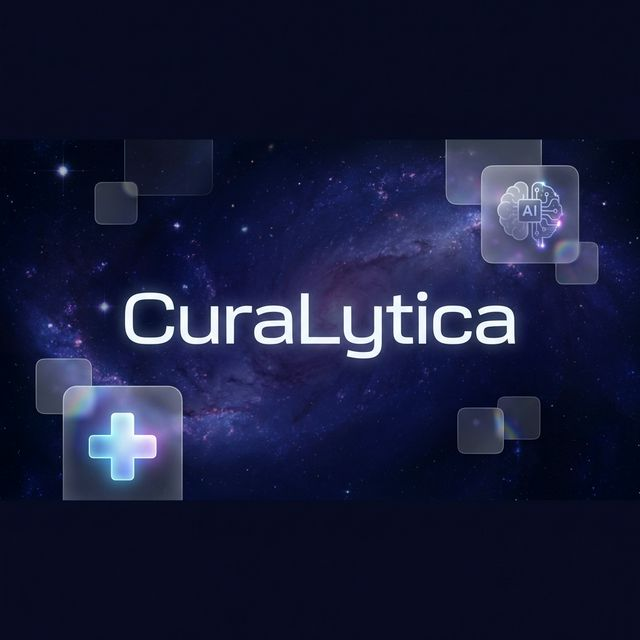

#  CuraLytica

CuraLytica is an AI-powered medical assistant designed to help patients and healthcare professionals analyze symptoms, lab reports, and medical imaging using advanced generative AI.



## Features

- **AI Chat Assistant**: Conversational medical guidance with context awareness.
- **Symptom Checker**: Structured analysis of symptoms with differential diagnosis.
- **Medical Image Analysis**: Upload X-rays, MRIs, or CT scans for AI interpretation.
- **Patient Profile**: Manage detailed patient context (Age, Conditions, Meds) for personalized insights.
- **Theme Support**: Beautiful light and dark modes with a modern glassmorphism UI.

## Tech Stack

- **Frontend**: React 19, Tailwind CSS, Framer Motion, Lucide React
- **Backend**: Flask, Google Gemini API, MCP (Model Context Protocol)
- **AI Models**: Gemini 1.5 Flash / 2.0 Flash

## Getting Started

### Prerequisites

- Node.js (v18+)
- Python (v3.10+)
- A Google Gemini API Key

### Installation

1.  **Clone the repository**
    ```bash
    git clone https://github.com/zainulnazir/CuraLytica.git
    cd CuraLytica
    ```

2.  **Backend Setup**
    ```bash
    cd backend
    python -m venv venv
    source venv/bin/activate  # On Windows: venv\Scripts\activate
    pip install -r requirements.txt
    ```

3.  **Configure Environment**
    Create a `.env` file in the `backend` directory:
    ```env
    GEMINI_API_KEY=your_actual_api_key_here
    ```

4.  **Frontend Setup**
    Open a new terminal:
    ```bash
    cd frontend
    npm install
    ```

### Running the App

The easiest way to start both the backend and frontend simultaneously is using the provided startup script:

1.  **Run with one command**
    ```bash
    ./start_system.sh
    ```
    *This will start the Flask server on port 5001 and the React dashboard on port 3000.*

---

#### Manual Startup (Optional)

If you prefer to start services individually:

1.  **Start Backend**
    ```bash
    cd backend
    python app.py
    ```

2.  **Start Frontend**
    ```bash
    cd frontend
    npm start
    ```

## License

This project is licensed under the MIT License.

## Author

**Zain Ul Nazir**
- GitHub: [@zainulnazir](https://github.com/zainulnazir)

---
**Disclaimer**: CuraLytica is an AI tool for informational purposes only and does not provide professional medical advice, diagnosis, or treatment. Always seek the advice of your physician.
